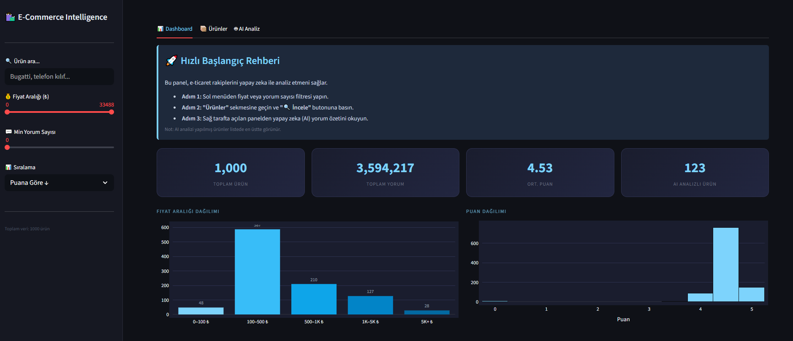
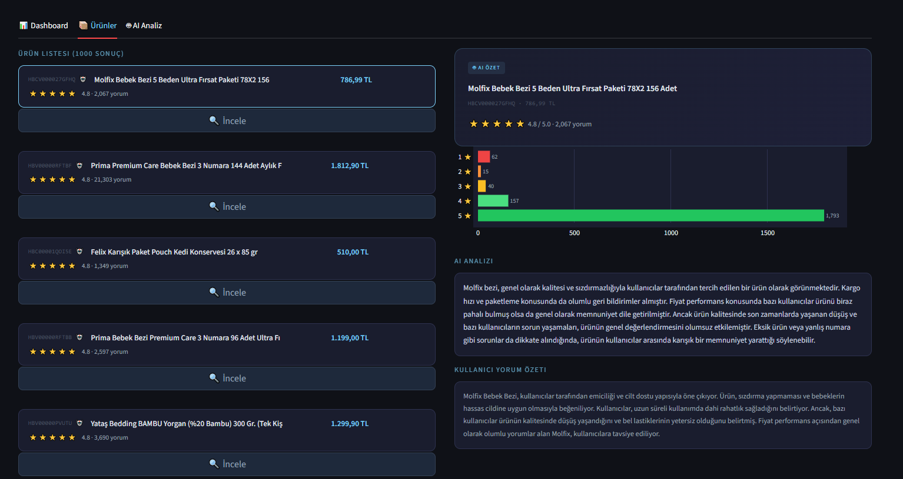
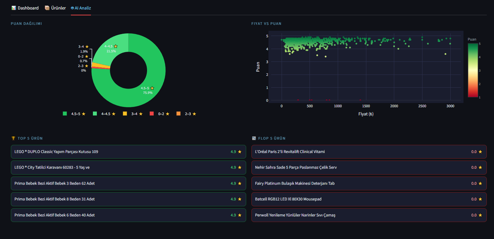
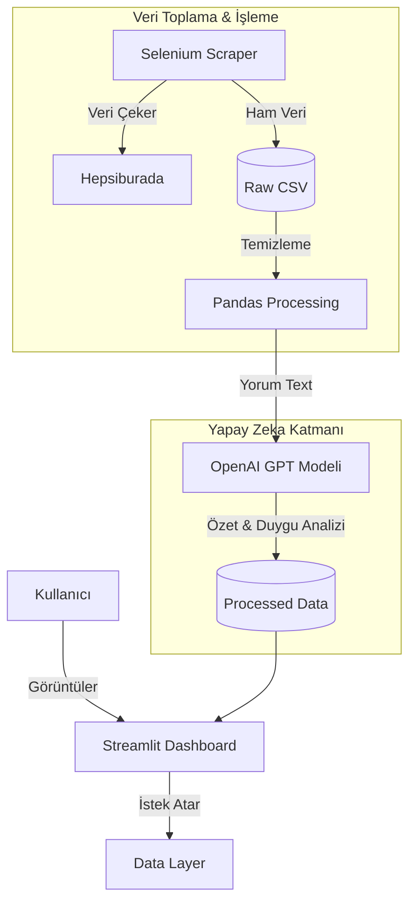

---

# 🛍️ E-Commerce Product Intelligence Dashboard

[](https://www.python.org/)
[](https://streamlit.io/)
[](https://openai.com/)
[](LICENSE)

> **Hepsiburada ürün verilerini analiz eden, kullanıcı yorumlarını Yapay Zeka (GPT) ile özetleyen ve satıcılar için stratejik içgörüler sunan uçtan uca veri analitiği platformu.**

---

## 📸 Proje Önizlemesi
<div align="center">
  
  <br><br>
  
  <br><br>
  
</div>


---

## 📊 Proje Metrikleri & Kapsam

Bu proje, büyük ölçekli e-ticaret verilerini işleyebilecek kapasitede tasarlanmıştır.

| 📦 Analiz Edilen Ürün | 💬 İşlenen Yorum | ⭐ Ortalama Puan | 🤖 AI Özet Sayısı |
| --------------------- | ---------------- | --------------- | ----------------- |
| **1,000+**            | **3,500,000+**   | **4.53 / 5.0**  | **130+**          |

---

## 🏗️ Sistem Mimarisi

Proje, veri kazıma (scraping), işleme (processing) ve sunum (presentation) katmanlarından oluşan modüler bir yapıya sahiptir.



### ⚙️ Çalışma Mantığı

1. **Link Toplama:** `product_link_scraper.py` kategori sayfalarını tarar ve nitelikli ürünleri (1000+ yorum) belirler.
2. **Veri Çekme:** Seçilen ürünlerin fiyat, puan ve yorum özetleri Selenium ile çekilir.
3. **AI Analiz:** `ai_analysis.py`, yorumları *chunk-based* (parçalı) yöntemle işler ve GPT modeline göndererek tek paragraflık stratejik özetler oluşturur.
4. **Görselleştirme:** İşlenen veriler Streamlit arayüzünde interaktif grafiklere dönüştürülür.

---

## 📂 Dosya Yapısı

```bash
ecommerce-intelligence/
├── app.py                          # 🚀 Ana uygulama (Dashboard giriş noktası)
├── requirements.txt                # Python kütüphane bağımlılıkları
├── .env                            # API Anahtarları (Git'e dahil edilmez)
├── src/
│   ├── scrapers/
│   │   ├── base_scraper.py         # Retry & Rate limiting mekanizması
│   │   └── product_link_scraper.py # Hepsiburada link toplama modülü
│   ├── ai_analysis/
│   │   └── ai_analysis.py          # GPT-3.5/4 entegrasyon servisi
│   └── config/                     # Merkezi konfigürasyon ayarları
└── data/
    ├── raw/                        # Scraper çıktısı ham veriler
    └── processed/                  # AI ve Pandas tarafından işlenmiş veriler
```

---

## ✨ Temel Özellikler

* **📈 İnteraktif Dashboard:** Fiyat dağılımı, puan analizi ve en çok yorum alan ürünlerin Plotly ile görselleştirilmesi
* **🤖 AI Destekli Yorum Analizi:** Binlerce yorumu okumak yerine yapay zeka tarafından oluşturulan “Alınır mı? / Alınmaz mı?” özetleri
* **🔍 Detaylı Filtreleme:** Fiyat aralığı, yorum sayısı ve puana göre gelişmiş filtreleme
* **⚔️ Rakip Kıyaslaması:** Best Seller ve potansiyeli düşük ürünlerin otomatik tespiti
* **🛡️ Robust Scraping:** Exponential backoff ve rate limiting ile kesintisiz veri akışı

---

## 💻 Kurulum ve Çalıştırma

### 1. Projeyi Klonlayın

```bash
git clone https://github.com/merveAiseoglu/ecommerce-intelligence-dashboard.git
cd ecommerce-intelligence-dashboard
```

### 2. Sanal Ortam Oluşturun (Önerilir)

```bash
python -m venv venv
# Windows
venv\Scripts\activate
# Mac / Linux
source venv/bin/activate
```

### 3. Kütüphaneleri Yükleyin

```bash
pip install -r requirements.txt
```

### 4. `.env` Dosyasını Ayarlayın

```env
OPENAI_API_KEY=sk-sizin-api-keyiniz-buraya
```

### 5. Uygulamayı Başlatın

```bash
streamlit run app.py
```


## Tarayıcıda otomatik olarak `http://localhost:8501` açılır.
====


---

## 👤 Geliştirici

Bu proje **Merve Aişeoğlu** tarafından geliştirilmiştir.


* 🐙 **GitHub:** [@merveAiseoglu](https://github.com/merveAiseoglu)
* 💼 **LinkedIn:** [Profilime Git](https://www.linkedin.com/in/merve-ai%C5%9Feo%C4%9Flu-6842b71b9/)

---

<div align="center">
⭐️ Bu projeyi beğendiyseniz sağ üst köşeden <b>Star</b> vermeyi unutmayın!
</div>

---


